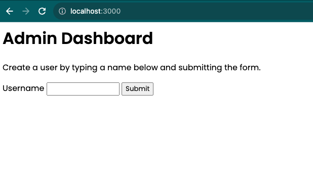

## NODE JS Basic Server

### Objectives of this project:

1. Create a nodejs server.
2. In the / (base path) add a input field called username and send this as a POST request to /create-user route.
3. Add /create-user route in the server, parse the form information and parse it, store it in usersList array and redirect to /users page.
4. Create a /users route, where we display list of created users.

### Screenshots

#### Dashboard

Add a new user on this page.

#### Users List

After adding a new user, this page shows list of added users.

### Steps to run this project locally.

Pre-requisites : Have latest node.js installed on your system.

1. Clone this repository.
2. Run `node app.js`
3. Go to browser and enter http://localhost:3000
